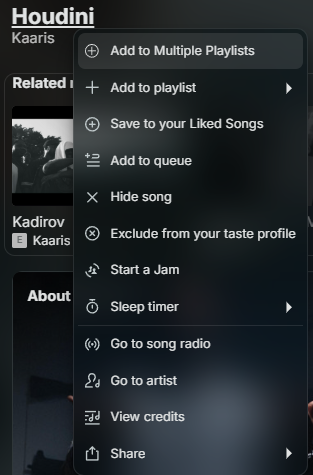
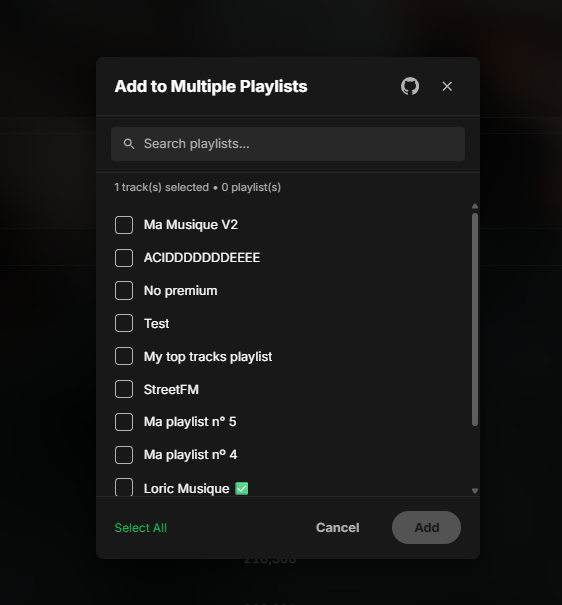

# Add to Multiple Playlists

Add tracks to multiple playlists at once from the context menu.

<table>
  <tr>
    <td></td>
    <td></td>
  </tr>
</table>

## Features
- **Multiple Selection** - Select multiple playlists and add tracks to all of them at once
- **"Select Multiple..."** - Opens a modal to select multiple song at once
- **Duplicate Detection** - Warns if tracks are already in selected playlists

## Usage

1. **Right-click** on one or more tracks in Spotify
2. Navigate to **"Add to Playlist"** in the context menu
3. Select **"Select Multiple..."** to choose multiple playlists
4. Check the playlists you want to add the tracks to
5. Click **"Add"** to confirm

Or directly click on a playlist name to add tracks to that single playlist.

## Development

```bash
# Build
deno task build

# Watch mode (rebuilds on changes)
deno task watch

# Dev build (auto-deploys to Spotify)
deno task dev-build
deno task dev-watch
```

## Contributing

Found a bug or want to contribute? Here's how you can help:

- **Issues**: [Open an issue](https://github.com/JimMarley420/spicetify-extension/issues/new/choose)
- **Pull Requests**: [Create a PR](https://github.com/JimMarley420/spicetify-extension/compare)
- **Discussion**: [Start a discussion](https://github.com/JimMarley420/spicetify-extension/discussions)

## License

Copyright (c) 2026 JimMarley420

All rights reserved. This extension is provided for personal use only.

**You are NOT allowed to:**
- Republish or redistribute this extension on Spicetify Marketplace
- Claim authorship of the original work
- Fork and redistribute (modifications for personal use are allowed)
